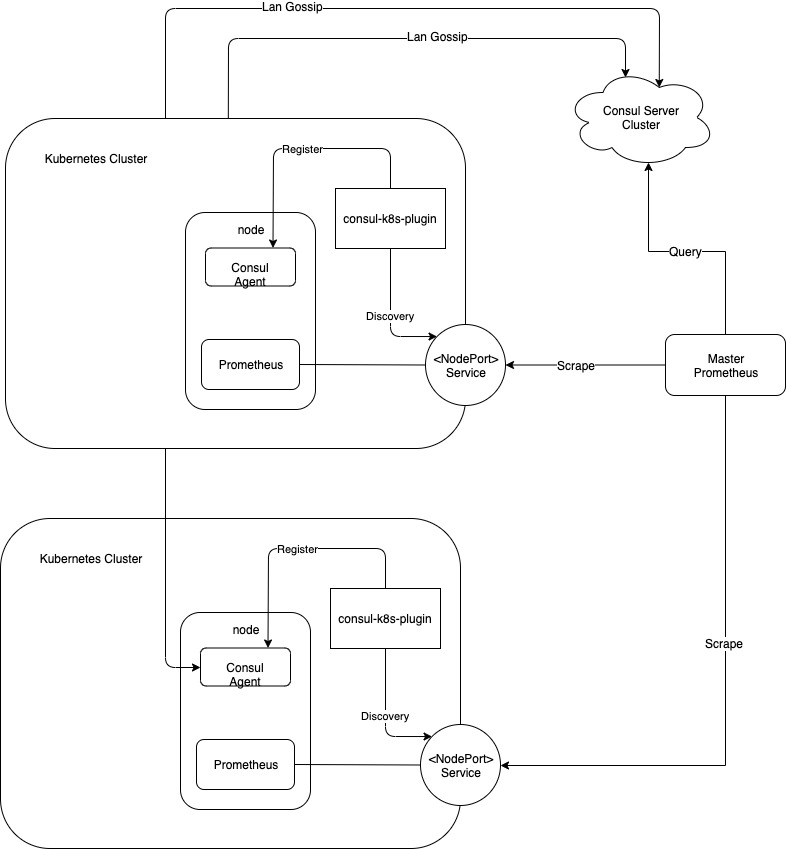
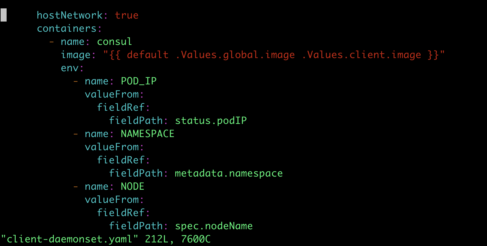

```
root@ip-172-31-45-198:/home/admin# cat consul-values.yml
global:
    enabled: false

client:
    enabled: true
    grpc: true
    join:
        - 172.31.42.249:8301

syncCatalog:
    enabled: true
    default: false
    toConsul: true
```
change client-daemonset.yaml


```
root@ip-172-31-45-198:/home/admin# cat prometheus-values.yml
podSecurityPolicy:
  enabled: true

server:
  service:
    type: NodePort
    nodePort: 30080
    annotations:
        "consul.hashicorp.com/service-sync": "true"

  replicaCount: 1
  retention: 48h

  global:
    scrape_interval: 15s
    scrape_timeout: 15s

  resources:
    requests:
      cpu: 10m
      memory: 1Gi

kubeStateMetrics:
  enabled: true

nodeExporter:
  enabled: true

alertmanager:
  enabled: false

pushgateway:
  enabled: false
```
```
root@ip-172-31-45-198:/home/admin# cat pv.yml
apiVersion: v1
kind: PersistentVolume
metadata:
  name: prometheus-server
spec:
  capacity:
    storage: 8Gi
  accessModes:
    - ReadWriteOnce
    - ReadOnlyMany
  persistentVolumeReclaimPolicy: Retain
  hostPath:
    path: /tmp/prometheus_data
```

```
kubectl create -f pv.yml

helm install -f prometheus-values.yml -n promethues stable/prometheus

watch -n 1 kubectl get pods


helm install -f consul-values.yml -n consul ./consul-helm
```
