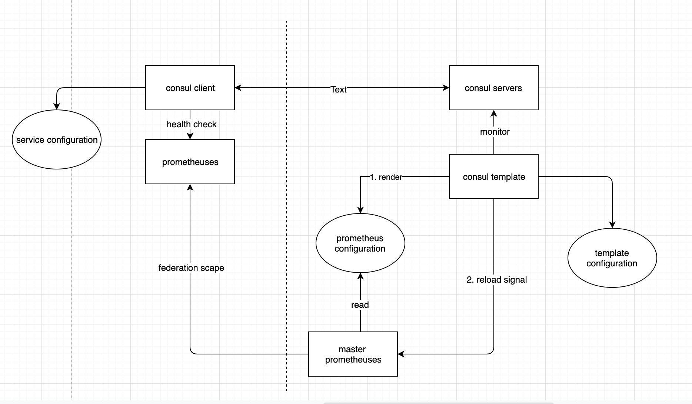
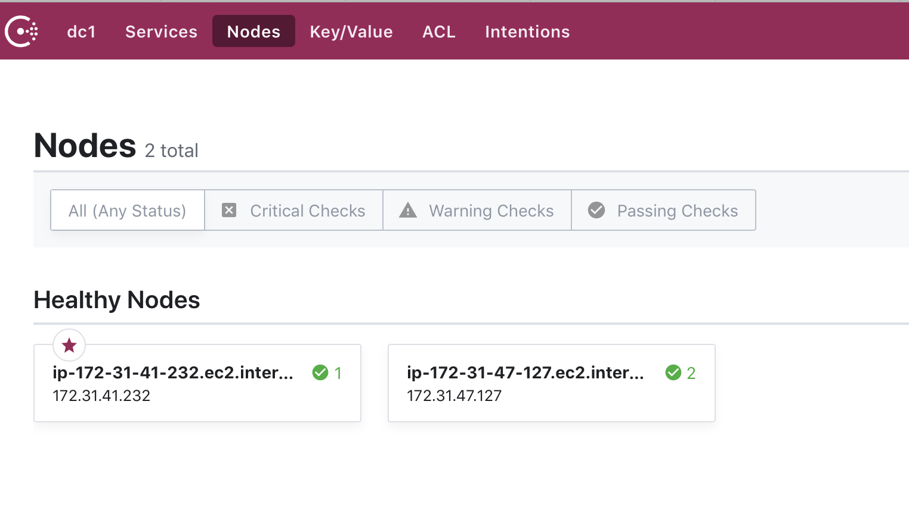
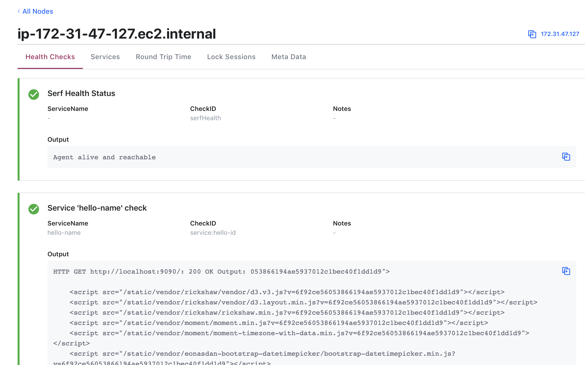

```
consul agent -ui --data-dir /tmp/consul --dev -bind '{{GetInterfaceIP "eth0"}}' -server --client=0.0.0.0

consul agent -ui --data-dir /tmp/consul --dev -bind '{{GetInterfaceIP "eth0"}}' --server=false --client=0.0.0.0 --join 172.31.41.232


consul client:
private IP: 172.31.47.127
public IP: 18.206.201.62
consul agent -ui --data-dir /tmp/consul --dev -bind '{{GetInterfaceIP "eth0"}}' --server=false --client=0.0.0.0 --join 172.31.41.232 --config-dir=/opt/consul


[root@ip-172-31-47-127 consul]# cat services.json
{
  "services": [
    {
      "id": "hello-id",
      "name": "hello-name",
      "tags": [
        "primary"
      ],
      "address": "172.31.47.127",
      "port": 9090,
      "checks": [
        {
        "http": "http://localhost:9090/",
        "tls_skip_verify": false,
        "method": "GET",
        "interval": "10s",
        "timeout": "1s"
        }
      ]
    }
  ]
}

consul server: 
public IP:54.89.154.123:
private IP: 172.31.41.232
consul agent -ui --data-dir /tmp/consul --dev -bind '{{GetInterfaceIP "eth0"}}' -server --client=0.0.0.0

http://54.89.154.123:8500
```



---
python command to start port


